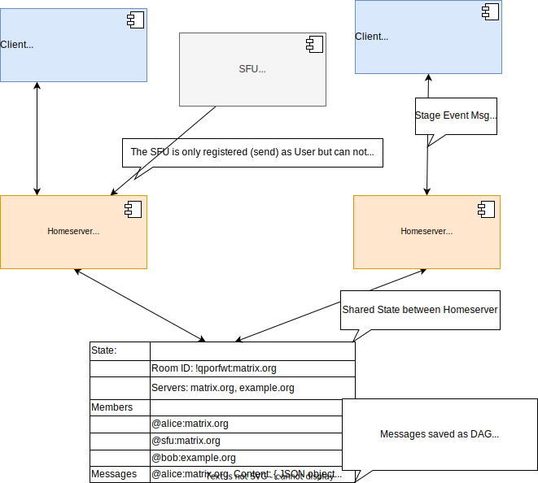

# Signaling

Signaling ist nicht alleine der Prozess  des Verbindungsaufbaus

Bei einer Videokonferenz  fallen verteilte Daten dieunterschiedliche Anforderungen in der Geschwindigkeit ihrer verteilung aufweisen:

1. Statische daten
2. mittel Actuell
3. Hochactuell

Daraus ergibt sich die Frage wie in einer verteilten VC die Daten efizient nach dem CRUD Prinzip verteilt werden können
https://github.com/matrix-org/matrix-spec-proposals/blob/6b98d667cf634f78c6604151276d5ef25d305aac/proposals/3401-group-voip.md

Es gibt drei verschiedene Message Arten
1. State Events
2. to-device Messages
3. DCs (DataChannel Messages)

## Mögliche Speicher Medien 

Aus den Message Arten ergeben sich Speichterarten 

### State Events and Room State

Stage Messages result in a persistent information (‘state’) related to a room shared between Homeservern.
Stage masseges are long time persistent, consistent but have a big delay on sharing between users. 

There are very good to share longtime information like:

### TO-device Messages
-- Device Messages

### DCs (DataChannel Messages)

-- Verteilung: Dive Messages

